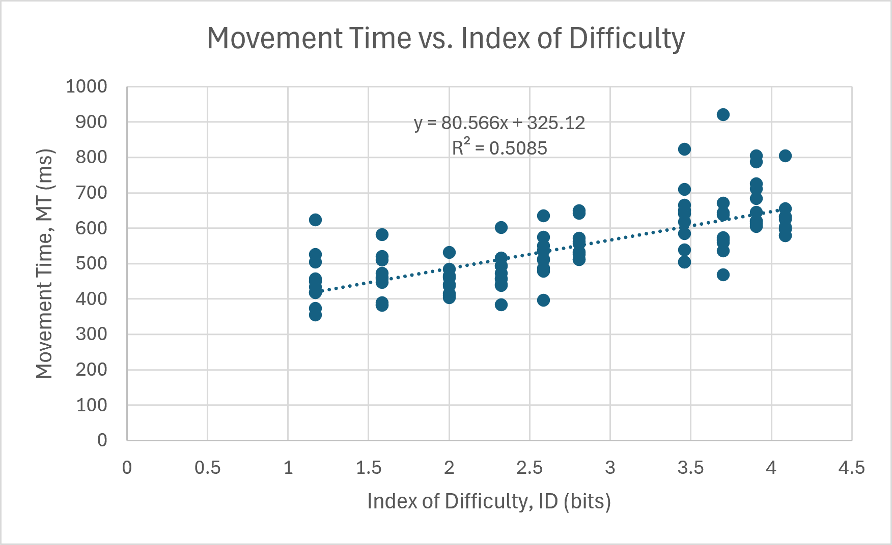
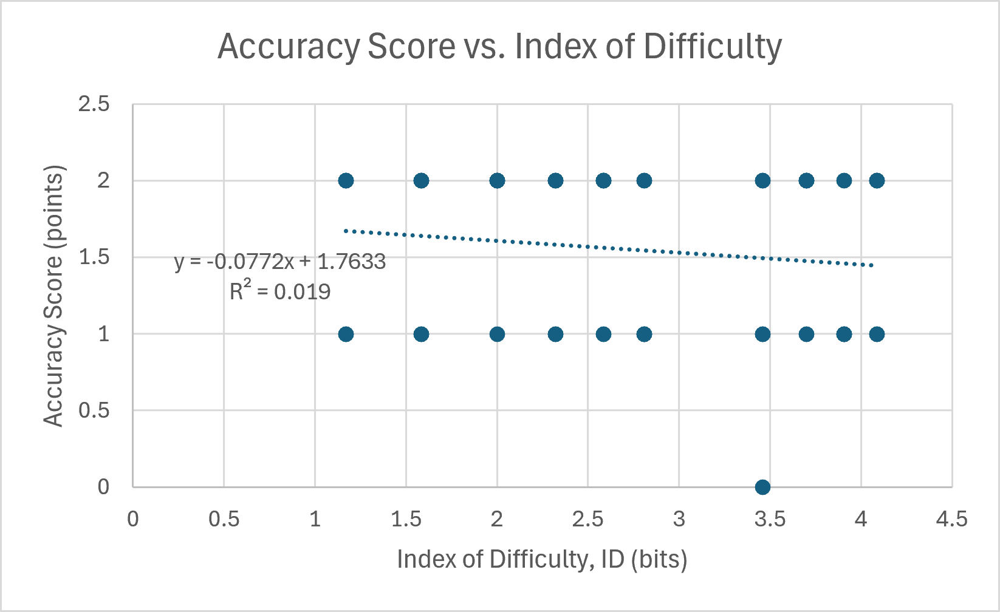

# Fitts' Law FPS Aim Trainer

**HCI Assignment 1 — Part II**
**Name:** Holy 司大衛
**Student ID:** 115034421
**Live Demo:** https://holy1009.github.io/fitts-law-fps-Holy/

## Scenario
This experiment simulates a competitive FPS aim-training environment (e.g., Valorant, CS2). Professional and high-level players spend hours practicing **aim** — the ability to move the crosshair to a target that may appear anywhere on screen and click it as quickly and accurately as possible.
**User:** Any FPS gamer practicing mouse aiming skills.
**Context:** A training session where targets appear one after another at varying distances and sizes, with no delay between them.

## Innovation
Unlike classical Fitts' Law experiments, this variant adds an **accuracy-scoring system** that mirrors real FPS hitboxes:
| Outcome | Points |
| Inner circle (headshot) | +2 |
| Outer ring (bodyshot) | +1 |
| Miss | −1 |
This lets us measure **2 dependent variables**:
1. **Movement Time (MT)** — classical Fitts' Law
2. **Accuracy points** — does difficulty also affect precision?
Additionally, the experiment uses **0 ms inter-trial delay** (instant respawn), reflecting the time-critical nature of competitive FPS where every millisecond matters.

## Method
- **100 trials**, randomized order
- **10 (A, W) configurations** × 10 trials each
- **A** = distance from previous target center to current target center (px)
- **W** = target diameter (px)
- **ID** = log₂(A/W + 1) bits
- **MT** = time from target appearance to first click (ms)
- 
### Configurations
| Config | A (px) | W (px) | ID (bits) |
|---|---|---|---|
| 1 | 150 | 120 | 1.17 |
| 2 | 200 | 100 | 1.59 |
| 3 | 300 | 100 | 2.00 |
| 4 | 400 | 100 | 2.32 |
| 5 | 500 | 100 | 2.58 |
| 6 | 600 | 100 | 2.81 |
| 7 | 500 | 50 | 3.46 |
| 8 | 600 | 50 | 3.70 |
| 9 | 700 | 50 | 3.91 |
| 10 | 800 | 50 | 4.09 |

## Experiment Video

## Results

### Figure 1 — Fitts' Law: Movement Time vs. Index of Difficulty

**Fitted equation:**
MT = 325.12 + 80.57 × ID
R² = 0.5085
The slope **b = 80.57 ms/bit** falls within the expected range for mouse pointing, validating Fitts' Law in this FPS context. The intercept **a = 325.12 ms** reflects baseline reaction time and device latency. The moderate R² = 0.51 indicates that ID is a meaningful but not exclusive predictor of movement time — trial-to-trial variability (attention, fatigue, mouse precision) accounts for the rest.

### Figure 2 — Accuracy: Points vs. Index of Difficulty

**Fitted equation:**
Points = 1.7633 − 0.0772 × ID
R² = 0.019
The slope **d = −0.0772** is slightly negative, suggesting a weak trend of decreasing accuracy as difficulty increases. However, **R² = 0.019 is essentially zero**, meaning ID does **not** meaningfully predict accuracy in this dataset. Only 5 of 100 trials involved a miss, indicating that participants maintained high accuracy across all difficulty levels.

## Discussion
**Fitts' Law is validated.** Movement time increases linearly with index of difficulty, with a slope of 80.57 ms/bit. This confirms that the Shannon formulation applies to the FPS aim-training context — targets that are farther away or smaller take proportionally longer to acquire.

**Accuracy does not degrade with difficulty.** Unlike movement time, accuracy scores showed no reliable relationship with ID (R² ≈ 0.02). This suggests that in a self-paced aim trainer, users prioritize accuracy over speed — they slow down on hard targets to maintain precision, which is exactly what the MT slope reflects.

**Speed–accuracy tradeoff.** Together, these two results tell a coherent story: when targets get harder, users take longer (MT ↑) but maintain accuracy (points ≈ constant). In competitive FPS, this translates to a strategic decision: rush easy shots, slow down on hard ones.

**Limitations.** A single participant (self-test) limits generalizability. Trial-to-trial noise (fatigue, focus) reduces R². Accuracy was near-ceiling (mean ≈ 1.8 points), restricting variance and making the accuracy regression less sensitive.

## Broader Application

Although designed for FPS aim training, the same interaction applies to any cursor-to-target task under time pressure. A concrete example: **online concert ticket purchasing** with a tight time limit. A target could represent a seat on a digital seating map. Users must select a specific seat from many small, closely positioned options — and the size and distance of those seats directly affect how quickly and accurately users can make their selection.

## Files

- `index.html` —  experiment
- `result.csv` — raw trial data (100 rows)
- `GraphMTvsID.png` — Fitts' Law regression
- `GrapACCvsID.png` — Accuracy regression
- `README.md` — report
